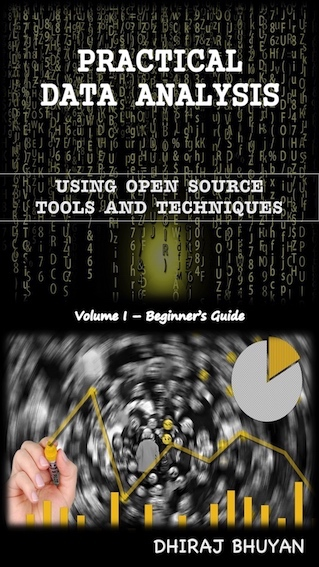

## Practical Data Analysis
### Using Open Source Tools & Techniques - Volume I (Beginner's Guide)
#### By Dhiraj Bhuyan

Disclaimer - The views, thoughts, and opinions expressed in the book belong solely to the author, and should not in any way be attributed to the author’s employer, or to the author as a representative, officer or employee of any organisation.
  
### About the Book:

“Practical Data Analysis – Using Open Source Tools & Techniques” uses a case-study based approach to explore some of the real-world applications of open source data analysis tools and techniques. Specifically, the following topics are covered in this book:

1.	Open Source Data Analysis Tools and Techniques.
2.	A Beginner’s Guide to “Python” for Data Analysis.
3.	Implementing Custom Search Engines On The Fly.
4.	Visualising Missing Data.
5.	Sentiment Analysis and Named Entity Recognition.
6.	Automatic Document Classification, Clustering and Summarisation.
7.	Fraud Detection Using Machine Learning Techniques.
8.	Forecasting - Using Data to Map the Future.
9.	Continuous Monitoring and Real-Time Analytics.

Amazon Link (Kindle Only) - https://www.amazon.co.uk/dp/B07FNHT42N  
Apple iBook - http://itunes.apple.com/us/book/id1413645989

 
### Purpose of the Book:
I have been working in the financial services industry for more than a decade, specialising in the review and assessment of complex banking platforms, business process automation and data. Working in an environment where almost all business activities inevitably leads to the creation, deletion or modification of some data in a system or digital repository, I had the opportunity to experience firsthand the benefits as well as the challenges that big data analytics presents.

During the past decade, data science concepts have also become more mainstream; and thanks to the tireless efforts and generosity of a great army of data enthusiasts, scientists, researchers and software developers, that a wide range of very powerful open source data analysis tools and techniques are now available for everyone to use and benefit from.

As our society, government institutions and businesses become more and more data centric, and as today’s manual tasks for repetitive and mundane activities get increasingly automated, we will no doubt see more wide scale adoption of these data analysis tools and techniques in the future. And given the current trends around digitisation, automation and artificial intelligence across many industries (the 4th industrial revolution as many would like to call it), it is inevitable that in not so distant future, most if not all white collared jobs will also require some degree of data analysis skills. It is, therefore, important that we continue to develop and hone our ability to analyse data, not because “data scientist” is going to be the sexiest job title to have in the coming decades, but to remain prepared for what will undoubtedly be expected of us, in the future, in a data centric and automation driven workplace.

While a large number of technical books have been written about open source data analysis tools and techniques, information on how they can be practically applied in our day to day work remains scattered in various Internet blog posts, online discussion forums and technical manuals. And every time a friend or a colleague asks me to recommend a book that will help them with some of the practical aspects of applying data analysis concepts in their everyday work, I struggle to name one. Hence, I decided to write this book, which I sincerely hope will fill this gap and inspire many to start thinking about how data analysis tools and techniques can assist them, not only in their workplace, but also in their day to day lives.

Dhiraj Bhuyan, 19 July 2018
